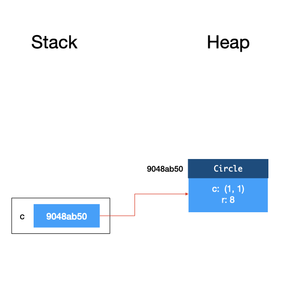
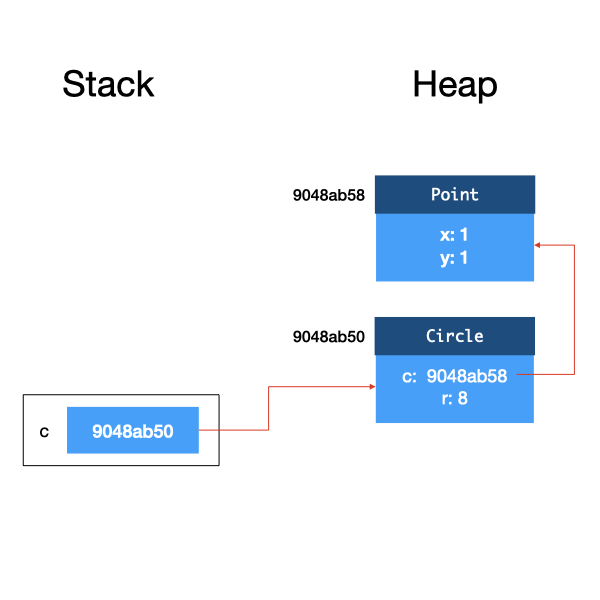
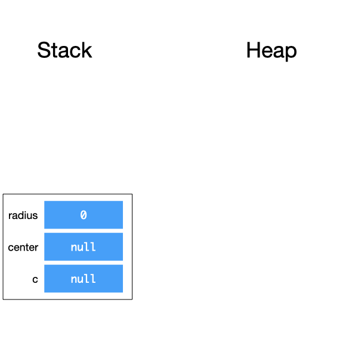
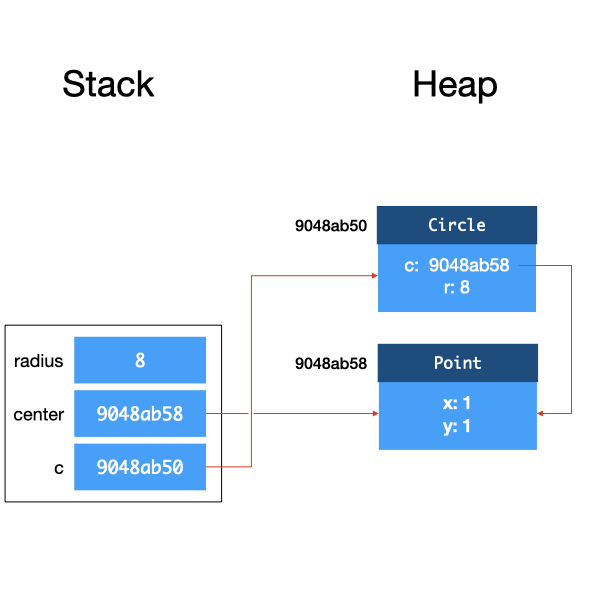
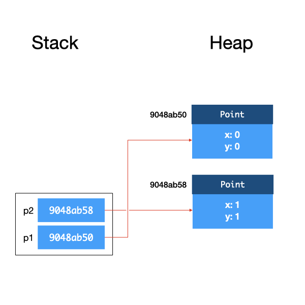
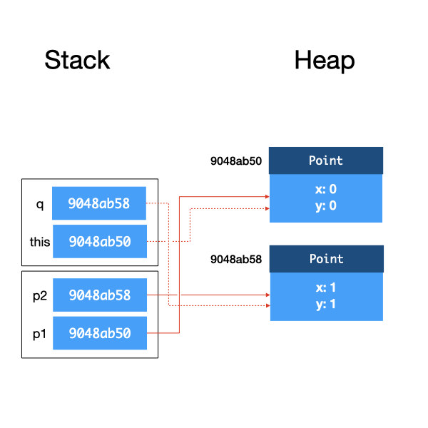
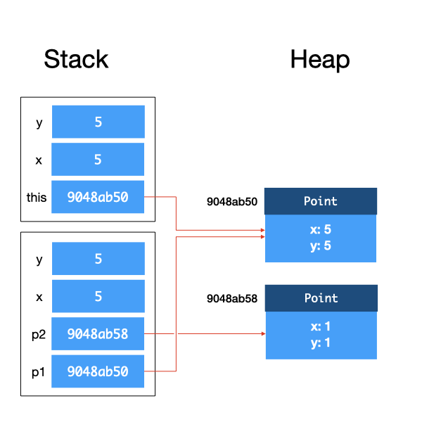

# Unit 10: Heap and Stack

After taking this unit, students should:

- understand when memory are allocated/deallocated from the heap vs. from the stack
- understand the concept of call stack in JVM


## Heap and Stack

The Java Virtual Machine (JVM) manages the memory of Java programs while its bytecode instructions are interpreted and executed.  Different JVM implementations may implement these differently, but typically a JVM implementation partitions the memory into several regions, including:

- _method area_ for storing the code for the methods;
- _metaspace_ for storing meta information about classes;
- _heap_ for storing dynamically allocated objects;
- _stack_ for local variables and call frames.

Since the concepts of heap and stack are common to all execution environments (either based on bytecode or machine code), we will focus on them here.

The _heap_ is the region in memory where all objects are allocated in and stored, while the _stack_ is the region where all variables (including primitive types and object references) are allocated in and stored.

Considers the following two lines of code.
```Java
Circle c;
c = new Circle(new Point(1, 1), 8);
```
Line 1 declares a variable `c`.  When Java executes this line of code, it allocates some memory space for an object reference for `c`, the content is initialized to `null`.  Since `c` is a variable, it resides in the stack.


Line 2 creates a new Circle object.  When Java executes this line of code, it allocates some memory space for a `Circle` object on the heap.  The memory address of this memory space becomes the reference of the object and is assigned to the variable `c`.

This is shown in the figure below.




The first argument to the `Circle` constructor is also an object, so to be more precise, when Line 2 above is executed, a `Point` object is also created and allocated on the heap.  So the field `c` inside `Circle` is actually a reference to this object.



Now, let's look at a slightly different example.  
```Java
Circle c;
Point center;
double radius;
radius = 8;
center = new Point(1, 1);
c = new Circle(center, radius);
```

In the second example, we have three variables, `c`, `center`, and `radius` .  Lines 1-3 declare the variables, and as a result, we have three variables allocated on the stack.  Recall that for object references, they are initialized to `null`.  Primitive type variables (e.g., `radius`) are initialized to 0.



After Lines 4-6, we have:



### Call Stack

Now, let's look at what happens when we invoke a method.  Take the `distanceTo` method in `Point` as an example:

```Java
class Point {
  private double x;
  private double y;

  public Point(double x, double y) {
    this.x = x;
    this.y = y;
  }

  public double distanceTo(Point q) {
    return Math.sqrt((q.x - this.x)*(q.x - this.x)+(q.y - this.y)*(q.y - this.y));
  }
}
```
and the invocation:
```Java
Point p1 = new Point(0,0);
Point p2 = new Point(1,1);
p1.distanceTo(p2);
```

After declaring `p1` and `p2` and creating both objects, we have:


When `distanceTo` is called, JVM creates a _stack frame_ for this instance method call.  This stack frame is a region of memory that tentatively contains (i) the `this` reference, (ii) the method arguments, and (iii) local variables within the method, among other things[^3][^4].  When a class method is called, the stack frame does not contain the `this` reference.

[^3]: This is not that difference from how an OS handles function call in a machine code, as you will see in CS2100/CS2106.
[^4]: The other things are JVM implementation independent and not relevant to our discussion here.



You can see that the _references_ to the objects `p1` and `p2` are copied onto the stack frame. `p1` and `this` point to the same object, and `p2` and `q` point to the same object.
Within the method, any modification done to `this` would change the object referenced to by `p1`, and any change made to `q` would change the object referenced to by `p2` as well.
After the method returns, the stack frame for that method is destroyed.

Let's consider a new `move` method for the class `Point` that has two arguments arguments `(double x, double y)` and moves the `x` and `y` cordinates of the `Point`.

```Java
class Point {
  private double x;
  private double y;

  public Point(double x, double y) {
    this.x = x;
    this.y = y;
  }

  public void move(double x, double y) {
    this.x = x;
    this.y = y;
  }
}
```

```Java
Point p1 = new Point(0,0);
Point p2 = new Point(1,1);
double x = 5;
double y = 5;
p1.move(x, y);
```

Again, we create a stack frame, copy the reference to object `p1` into `this`, copy `x` from the calling method to `x` the argument within the method, copy `y` from the calling method to `y` the argument within the method.   



What is important here is that, as `x` and `y` are primitive types instead of references, we copy the values onto the stack.  If we change `x` or `y` within `move`, the `x` and `y` of the calling function will not change.  This behavior is the same as you would expect in C.  However, unlike in C where you can pass in a pointer to a variable, you cannot pass in a reference to a primitive type in any way in Java.  If you want to pass in a variable of primitive type into a method and have its value changed, you will have to use a _wrapper class_.  The details of how to do this are left as an exercise.

To summarize, Java uses _call by value_ for primitive types, and _call by reference_ for objects.

If we made multiple nested method calls, as we usually do, the stack frames get stacked on top of each other. 

One final note: the memory allocated on the stack are deallocated when a method returns.  The memory allocated on the heap, however, stays there as long as there is a reference to it (either from another object or from a variable in the stack).  Unlike C or C++, in Java, you do not have to free the memory allocated to objects.  The JVM runs a _garbage collector_  that checks for unreferenced objects on the heap and cleans up the memory automatically.
