# Panopto Guide for CS2030S

This guide is for Windows and Mac users.  Linux users should use FFmpeg (see [SoC e-Exam SOP](https://mysoc.nus.edu.sg/academic/e-exam-sop-for-students/) for instructions).

## Installing Panopto

1. In LumiNUS, click CS2030S under **My Modules** > **Enrolled Modules**.

2. Scroll down on the left-hand sidebar. Click **Multimedia**.

3. Click on channel **Screen Recordings**.

4. Click on the **Create** button at the top of your page. Select "**Panopto for Windows**" or "**Panopto for Mac**". A pop up window appears.

    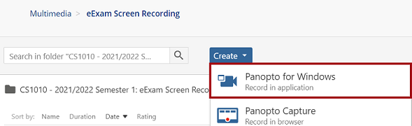

5. In the pop up window, click on the **Download Panopto** button. Wait for the installer to be downloaded.

    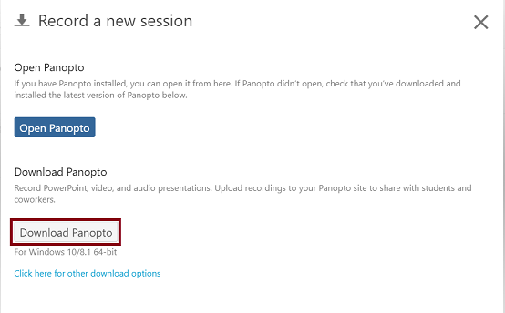

6. Install Panopto. If you encounter any issues during installation, disable any anti-virus software and firewall, and try again.

7. Panopto will be launched after the installation is complete. Close the launched Panopto window.

## Recording and Uploading

1. In LumiNUS, click CS2030S under **My Modules** > **Enrolled Modules**.

2. Scroll down on the left-hand sidebar. Click Multimedia.

3. Click on channel "Screen Recordings".

4. For testing, click on folder "Panopto Testing".  For actual assessment, a different folder will be used.

    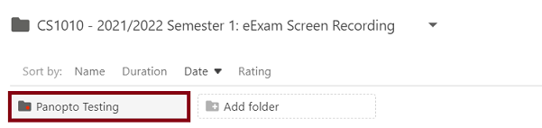

5. Inside the folder, click on the **Create** button at the top of your page. Select "**Panopto for Windows**" or "**Panopto for Mac**". A pop up window appears.

    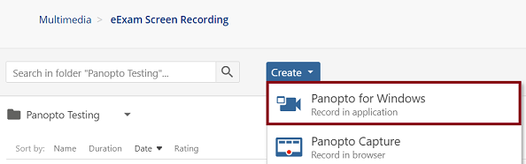

6. In the pop up window, click on the "**Open Panopto**" button. Panopto will launch.

    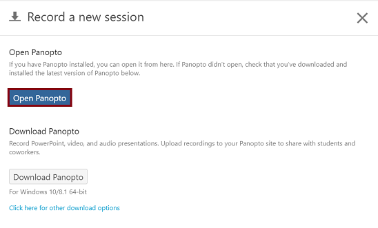

7. Configure Panopto Settings：
 
    1. Click **Settings** on the top of the Panopto window

    2. Under **Basic Settings**, uncheck "**Progressively upload while recording**".

        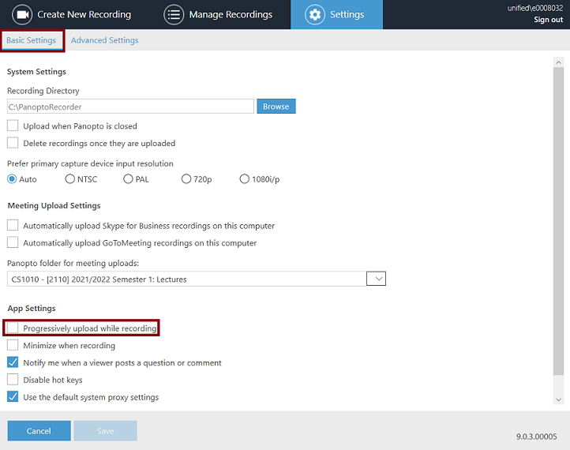

    3. Under **Advanced Settings**, uncheck "Enable no audio detected alerts".
    
    4. Under **Advanced Settings**, check "**Capture in MP4 format**".

        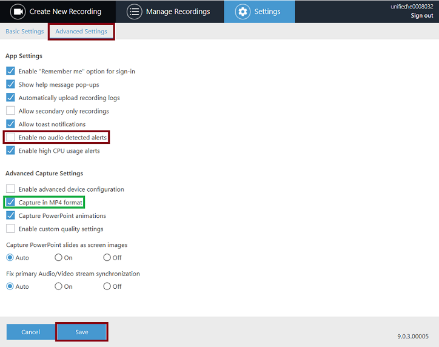

    5. Click **Save** at the bottom of the window.  You should have returned to the default page **Create New Recording**.

8. Configure new recording setups on **Create New Recording** page:

    1. Under **Session Settings**, set **Name** of your recording as "your NUS user ID_Test" e.g. "E0008032_Test".

    2. On the left panel of the window, under **Primary Sources**, 

         1. Select **Video** sources to be **None**.

         2. Check **Capture Computer Audio**.

    3. On the left panel of the window, under **Secondary Sources**,

         1. Uncheck **Capture PowerPoint**.

    4. On the bottom of the right panel **Main Screen**,

         1. Set *fps* to be the minimum allowed (4).

         1. Set *kbps* to be the minimum allowed (340). 

    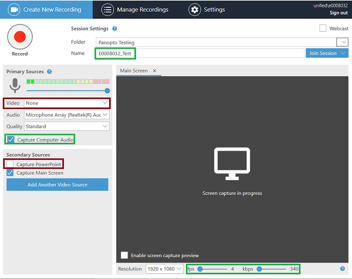

9. Start recording by clicking on the **Record** button on top left of the **Create New Recording** page.

    Note that you have to select an audio source in order to enable the **Record button**, if your computer does not have an audio device, please approach your lab tutor.

10. Click **Stop** on top left of the **Create New Recording** page. A pop up will appear indicating **Recording is Complete**.
Click **Done** on the popup.

    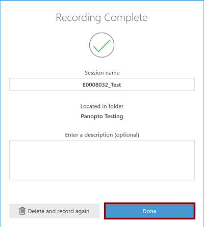

11. Your recording is currently being uploaded to the folder **Screen Recordings** > **Panopto Testing**. You should see the status of your recording similar to the screenshot below after the recording is uploaded successfully.

    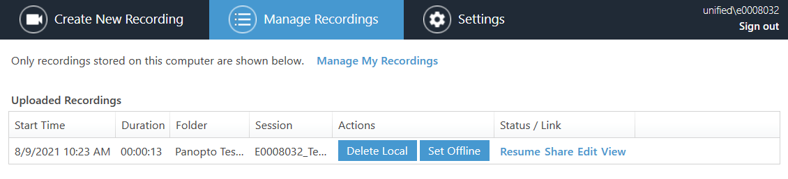

12. Check the LumiNUS folder that your recording is now displayed in the LumiNUS folder.

    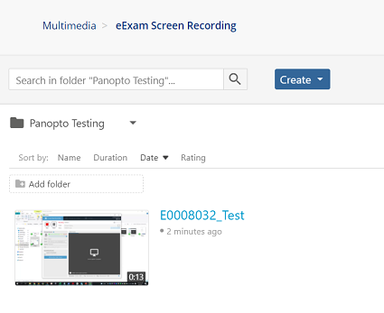

13. Congratulations you are done!

Prepared by Song Kai, Luo Xinjian, Wang Chengxin for CS1010.
Adapted by Wei Tsang for CS2030S
